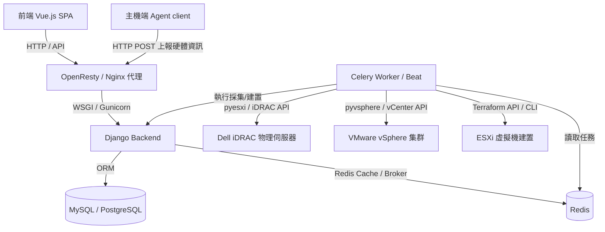

# XCMDB 專案架構與核心模組解析 (GEMINI.md)

> [!NOTE]
> 本文件旨在解析 **XCMDB** 專案的軟體架構、資料流及自動化流程，作為開發團隊與 Gemini 的核心上下文參考。

---

## 1. 系統整體架構圖

本系統是一個基於 **前後端分離** 的 IT 資產管理系統 (CMDB)，並整合了 **vSphere 虛擬化採集**、**iDRAC 物理伺服器採集**與 **Terraform 虛擬機自動化部署**：



---

## 2. 專案目錄結構與核心職責

本專案主要由後端、前端、主機採集 Agent、以及 Docker 容器部署配置組成：

*   **[backend/](file:///Users/maliao.kuo/PycharmProjects/XCMDB/backend)**: Django 2.1.4 後端服務。
    *   **[cmdb/](file:///Users/maliao.kuo/PycharmProjects/XCMDB/backend/cmdb)**: 後端主專案目錄。
        *   **[assets/](file:///Users/maliao.kuo/PycharmProjects/XCMDB/backend/cmdb/assets)**: 資產管理 App，管理 IDC、機櫃、標籤以及整合不同設備類型。
        *   **[hosts/](file:///Users/maliao.kuo/PycharmProjects/XCMDB/backend/cmdb/hosts)**: 伺服器與主機 App，包含物理伺服器、硬體配備（CPU、NIC、Disk、Memory）以及 iDRAC 採集邏輯。
        *   **[vm/](file:///Users/maliao.kuo/PycharmProjects/XCMDB/backend/cmdb/vm)**: 虛擬化與建置 App，負責與 vSphere 同步資源，並藉由 Terraform 自動建置虛擬機。
        *   **[authentication/](file:///Users/maliao.kuo/PycharmProjects/XCMDB/backend/cmdb/authentication)**: 用戶認證模組，支援 LDAP 登入與 API Token 認證。
        *   **[settings/](file:///Users/maliao.kuo/PycharmProjects/XCMDB/backend/cmdb/settings)**: 系統全局參數設定（iDRAC/vCenter 等憑證配置）。
        *   **[tasks/](file:///Users/maliao.kuo/PycharmProjects/XCMDB/backend/cmdb/tasks)**: Celery 定期任務管理與執行日誌模組。
*   **[frontend/](file:///Users/maliao.kuo/PycharmProjects/XCMDB/frontend)**: Vue 2 + Element-UI 前端應用。
    *   **[src/router.js](file:///Users/maliao.kuo/PycharmProjects/XCMDB/frontend/src/router.js)**: 前端視圖路由配置，劃分為儀表盤、資產（Asset）、虛擬化管理（Instance/Cluster/PHost）、機房機櫃（IDC/Rack/ISP）等選單。
*   **[client/](file:///Users/maliao.kuo/PycharmProjects/XCMDB/client)**: 部署於伺服器上的 Agent，採集硬體資訊（lshw, psutil）並定時上報給 Django 後端。
*   **[compose/](file:///Users/maliao.kuo/PycharmProjects/XCMDB/compose)**: Docker 服務容器配置。
*   **[docker-compose.yml](file:///Users/maliao.kuo/PycharmProjects/XCMDB/docker-compose.yml)**: 生產環境容器編排配置。

---

## 3. 後端核心資料模型 (Data Models)

### 3.1 資產多型關係設計 ([assets/models.py](file:///Users/maliao.kuo/PycharmProjects/XCMDB/backend/cmdb/assets/models.py))

系統使用 Django ContentTypes 的 GenericForeignKey 機制來將 `Asset` 作為統一資產的抽象，關聯具體的設備型態：

| 模型名稱 | 說明 | 欄位關聯 / 特性 |
| :--- | :--- | :--- |
| **`Asset`** | 資產表 | 透過 `GenericForeignKey` 關聯 `Host`、`NetworkDevice` 或 `Storage` |
| **`IDC`** | 機房表 | 管理樓層、機房名稱 |
| **`Rack`** | 機櫃表 | 對應 `IDC` (一對多)，設定高度 (U) 與 ISP 關聯 |
| **`RackUnit`** | 機櫃使用表 | 紀錄 `Asset` 與機櫃 `Rack` 的 U 位佔用關係 |
| **`NetworkDevice`** | 網路設備表 | 路由器、交換機、防火牆。包含 SN、型號、管理 IP 等 |
| **`Storage`** | 存儲設備表 | 整合 `StorageCtl` (控制器), `StorageNic` (網卡), `StorageDisk` (硬碟) |

### 3.2 伺服器與硬體資訊設計 ([hosts/models.py](file:///Users/maliao.kuo/PycharmProjects/XCMDB/backend/cmdb/hosts/models.py))

用於精確記錄實體主機與虛擬機的硬體層面細節，並支援 iDRAC 定期同步：

*   **`Host`**: 主機核心表。區分 `cate` (1: 伺服器, 2: 虛擬機)。記錄作業系統平臺、版本、總 Core 數、總 Memory、總 Disk。如果是伺服器則會自動觸發建立關聯的 `Asset`。
*   **`CPU` / `NIC` / `Disk` / `Memory`**: 主機硬體組件的詳情，與 `Host` 建立多對一的 ForeignKey 關係。
*   **`IDRAC`**: 管理物理機 Dell iDRAC IP、連接埠與綁定的 Celery PeriodicTask。
*   **`CmdRecord` / `RunUser`**: 主機端遠端執行腳本的指令與金鑰憑證管理。

### 3.3 虛擬化與建置設計 ([vm/models.py](file:///Users/maliao.kuo/PycharmProjects/XCMDB/backend/cmdb/vm/models.py))

針對 VMware vSphere 資源管理與虛擬機自動化開機設計：

*   **`Instance`**: VMware 虛擬機實例，記錄 vSphere 狀態 (hw_power_status: 運行中、已停止、建置中)、UUID、Mac、IP，以及所屬的物理宿主機 `Host`。
*   **`Cluster`**: ESXi 主機集群。
*   **`DataStore`**: vSphere 儲存池容量與剩餘空間。
*   **`NetWork`**: vSphere Portgroup / VLAN。
*   **`VM`**: 虛擬機**建置任務記錄**，保留建置狀態、規格（CPU/RAM/Disk）與對應的 `Instance`。

---

## 4. 關鍵自動化流程

### 4.1 定期物理機/虛擬化資源採集

1.  **Dell iDRAC 同步 (`idracinfo` 任務)**
    *   定義在 [hosts/tasks.py](file:///Users/maliao.kuo/PycharmProjects/XCMDB/backend/cmdb/hosts/tasks.py#L1892)。
    *   藉由 `pyesxi.dellemc_get_system_inventory` 抓取實體伺服器硬體結構，並透過 `DellSync` 解析，將硬體數據同步至 `Host` 及其關聯的 CPU、NIC、Disk、Memory 表中。
2.  **vSphere 資源同步 (`sync_guest` 任務)**
    *   定義在 [vm/tasks.py](file:///Users/maliao.kuo/PycharmProjects/XCMDB/backend/cmdb/vm/tasks.py#L63)。
    *   調用 `pyvsphere.Vsphere` 去取得 vCenter 上的集群、網路、DataStore、ESXi 主機與其上所有 VM 實例，在資料庫中完整重現 vSphere 當下的拓撲結構。

### 4.2 虛擬機自動化建置 (Terraform 整合)

當用戶在前端提出虛擬機建置申請，後端會觸發 [vm/tasks.py](file:///Users/maliao.kuo/PycharmProjects/XCMDB/backend/cmdb/vm/tasks.py#L148) 中的 `create` 任務：

```
[前端發起 VM 建立請求] -> [寫入 VM 任務紀錄，狀態為初始化中] -> [觸發 Celery Tasks]
                                                                  |
                                                                  v
[Django 更新 Instance 詳情] <- [解析 vSphere Facts] <- [執行 terraform apply]
```

*   **動態產生 tfvars.json**: `Create` / `CustomIPCreate` 類別 (定義在 [create.py](file:///Users/maliao.kuo/PycharmProjects/XCMDB/backend/cmdb/src/pyterraform/terraform/create.py#L7)) 會讀取預設範本 `terraform_example.tfvars.json`，將使用者填寫的規格 (CPU、RAM、VLAN、IP 等) 合併寫入該伺服器的專屬 `terraform.tfvars.json` 檔案中。
*   **執行佈署**: 調用 `terraform apply -auto-approve` 命令呼叫 vSphere API 建立 VM。
*   **自動銷毀機制**: 若建置任務失敗，[vm/tasks.py](file:///Users/maliao.kuo/PycharmProjects/XCMDB/backend/cmdb/vm/tasks.py#L44) 的 `vm_destroy` 任務會調用 `terraform destroy` (透過 `terraform.DeleteF`) 清理 vSphere 殘留資源。

---

## 5. 後端依賴管理 (uv)

本專案後端已切換至以 `uv` 進行管理，其設定與工作流設計如下：

### 5.1 設定與依賴結構

*   **[pyproject.toml](file:///Users/maliao.kuo/PycharmProjects/XCMDB/backend/pyproject.toml)**：聲明專案的基礎依賴，並設置 Python 版本要求 `requires-python = ">=3.8"`。
*   **[uv.lock](file:///Users/maliao.kuo/PycharmProjects/XCMDB/backend/uv.lock)**：鎖定所有直接依賴與子依賴的版本，確保開發環境一致性。
*   **依賴覆寫 (Overrides)**：因 `django-celery-beat==2.0.0` 宣告要求 `django-timezone-field>=4.0`（而此版本進而要求 `django>=2.2`），導致與當前 `django==2.1.4` 衝突。在 `pyproject.toml` 中，我們配置了 `[tool.uv.override-dependencies]` 將 `django-timezone-field` 強制鎖定在相容的 `3.1` 版本，解決了依賴解析問題。

### 5.2 依賴同步與建置工作流

1.  **新增或升級套件**：
    在 `backend` 目錄下執行：
    ```bash
    uv add <package-name>
    ```
2.  **生成部署 `requirements.txt`**：
    每次變更依賴後，執行以下指令重新生成 Docker 相容的依賴清單：
    ```bash
    uv pip compile pyproject.toml -o requirements.txt
    ```
3.  **Docker 映像檔建置優化**：
    In **[Dockerfile](file:///Users/maliao.kuo/PycharmProjects/XCMDB/compose/django/Dockerfile)** 中，我們採用了 multi-stage 引入 `uv`，並透過 `uv pip install --system --no-cache -r /requirements.txt` 替代傳統 pip，大幅加速了容器的依賴建置速度。

### 5.3 前端依賴統一與一鍵開發環境建置 (Makefile)

為了避免 `npm` 與 `yarn` 依賴鎖定衝突並簡化開發環境安裝流程，我們對專案進行了以下整合：

*   **強制限用 Yarn**：在 **[package.json](file:///Users/maliao.kuo/PycharmProjects/XCMDB/frontend/package.json)** 中加入了 `preinstall` 限制，任何不小心使用 `npm install` 的操作都會被自動阻止，確保依賴唯一性。
    *   *為什麼統一推薦使用 Yarn？*
        1.  **確保依賴穩定**：專案歷史依賴已透過 **[yarn.lock](file:///Users/maliao.kuo/PycharmProjects/XCMDB/frontend/yarn.lock)** 嚴格鎖定，更換為 npm 可能因依賴套件的小版本漂移引入不相容的 Bug。
        2.  **避免 lockfile 衝突**：避免多人協作時同時產生 `package-lock.json` 與 `yarn.lock`，破壞 Docker/CI 環境的一致性。
        3.  **快取與效能**：Yarn 的本機全域快取和並行下載機制，在大專案中（如安裝 `echarts`、`element-ui` 等）速度明顯優於傳統 npm。
*   **一鍵式開發工具 ([Makefile](file:///Users/maliao.kuo/PycharmProjects/XCMDB/Makefile))**：在專案根目錄提供了一套簡單的自動化任務，開發者只需要敲入以下指令即可啟動開發環境：

```bash
# 1. 一鍵安裝前後端依賴，並完成資料庫初始化與 Demo 數據富化
make install

# 2. 一鍵並行啟動 Django API、Vue UI 與 Celery Worker 開發服務
make dev
```

### 5.4 本地開發 Port 規劃（避免與現有服務衝突）

為了避免與本地其他開發中服務衝突，我們對系統的 Port 進行了如下規劃：

| 服務模組 | 預設 Port | 本地開發 Port | 說明與配置檔案 |
| :--- | :--- | :--- | :--- |
| **OpenResty (Nginx)** | `80` | `8080` | [docker-compose-dev.yml](file:///Users/maliao.kuo/PycharmProjects/XCMDB/docker-compose-dev.yml)。本地存取：`http://127.0.0.1:8080/` |
| **Django 後端 API** | `8000` | `18000` | [backend/.dev.env](file:///Users/maliao.kuo/PycharmProjects/XCMDB/backend/.dev.env) 與 [Makefile](file:///Users/maliao.kuo/PycharmProjects/XCMDB/Makefile) |
| **Vue 前端 Web** | `9528` | `19528` | [Makefile](file:///Users/maliao.kuo/PycharmProjects/XCMDB/Makefile) 與 [vue.config.js](file:///Users/maliao.kuo/PycharmProjects/XCMDB/frontend/vue.config.js) (預設埠) |

在前端配置中，[frontend/.env.development](file:///Users/maliao.kuo/PycharmProjects/XCMDB/frontend/.env.development) 中的 `VUE_APP_CORE_HOST` 已經對應調整為後端 Port `http://127.0.0.1:18000`，且 WebSocket 連線亦會自動匹配此埠。


