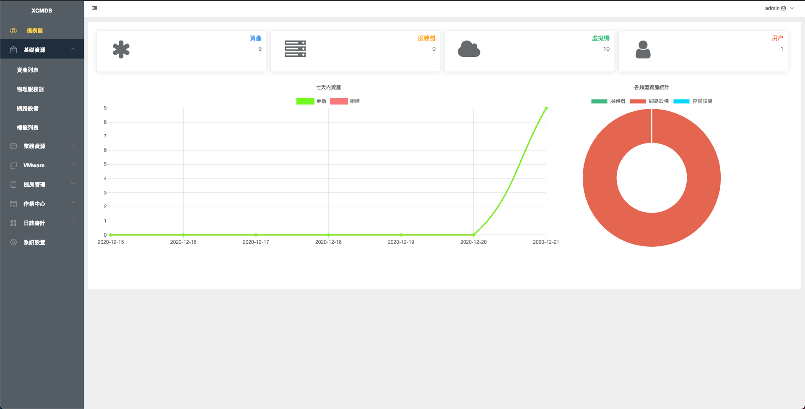
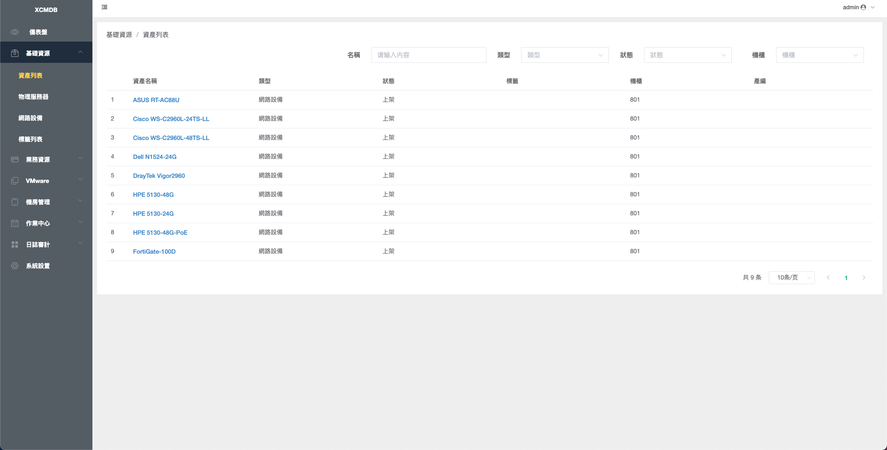
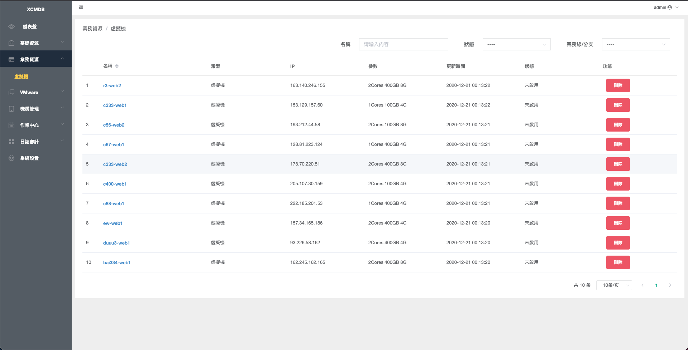
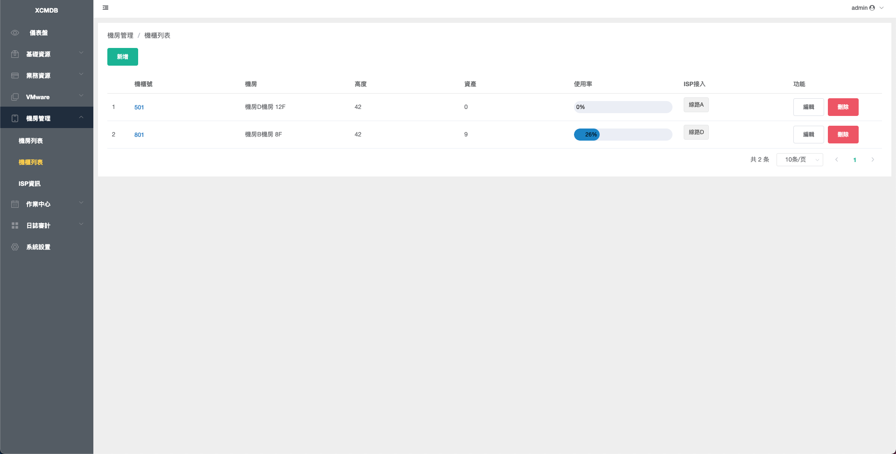
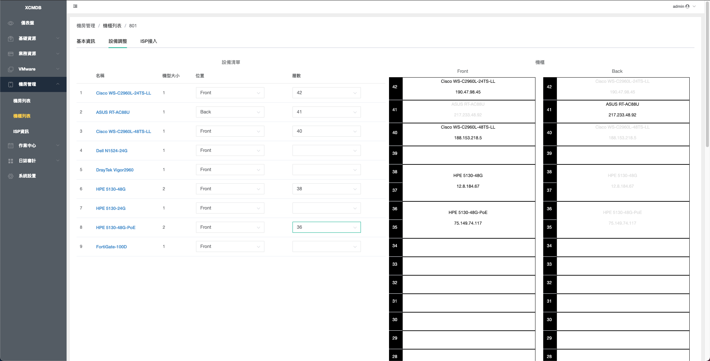
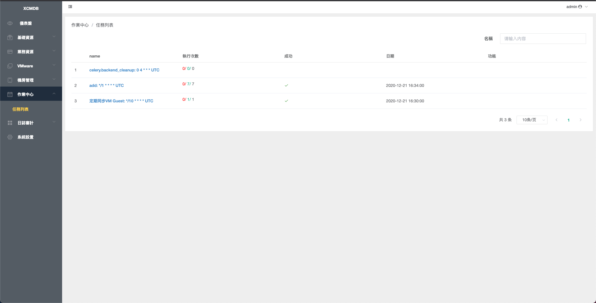
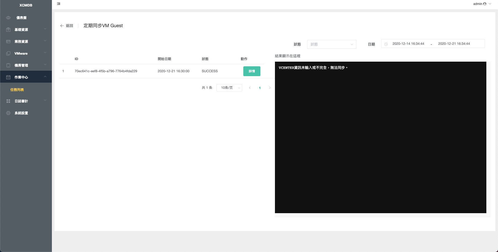
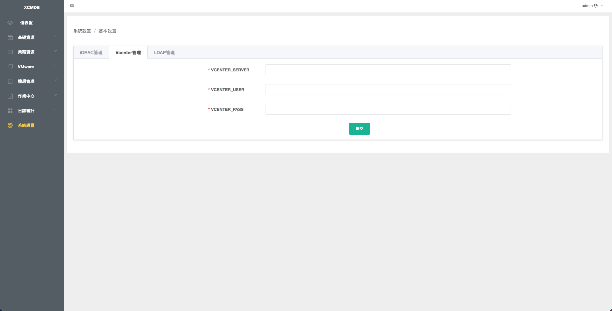

# XCMDB

簡易管理資產，定期採集ESXI、vsphere資源，IDC管理。

## 專案概述

XCMDB是一個資產管理系統，主要用於管理IT基礎設施資源，包括實體伺服器、虛擬機、機房和機櫃等。系統支持定期採集ESXI和vsphere資源信息，並提供IDC（互聯網數據中心）管理功能。

## 開發語言與框架

- 編程語言：Python 3.6
- 前端Web框架：Vue.js
- 後端Web框架：Django 2.1.4
- 後端Task框架：Celery 4.4.6 + Redis 5.0
- 資料庫：MySQL (開發環境) / PostgreSQL (生產環境)

## 功能

- 支持LDAP登入
- 資產管理
- 機房/機櫃 管理
- 採集iDRAC信息
- 採集vsphere信息(Cluster、Host、Instance)
- 快速創建Vmware虛擬機

## 專案結構

```
ansible/        # 用於推送腳本
client/         # 虛擬機資產回報agent
backend/        # 後台服務端
  cmdb/         # Django應用
  files/        # 文件存儲
  utils/        # 工具函數
frontend/       # 前台服務端 (Vue.js)
compose/        # Docker配置
  django/       # Django服務配置
  openresty/    # Openresty服務配置
openresty/      # Openresty配置
```

## 核心依賴

- [pyvsphere](https://github.com/Maliaotw/pyvsphere.git) - 用於與VMware vSphere交互
- [pyesxi](https://github.com/Maliaotw/pyesxi.git) - 用於與VMware ESXi交互

## 部署說明

### 開發環境

```bash
# 創建網絡
docker network create cmdb

# 啟動服務
docker-compose -f docker-compose-dev.yml up -d

# 重新載入Nginx配置
docker-compose -f docker-compose-dev.yml exec openresty bash -c "nginx -s reload"
```

### 生產環境

```bash
# 創建網絡
docker network create ops

# 啟動服務
docker-compose up -d
```

## Backend 安裝與設定

### 環境需求

- Python 3.8
- MySQL 5.7 (開發環境) 或 PostgreSQL (生產環境)
- Redis 5.0
- 相關系統依賴 (build-essential, libpq-dev, libldap2-dev, libsasl2-dev 等)

### 手動安裝步驟

如果您想在不使用Docker的情況下安裝後端，請按照以下步驟操作：

1. 安裝系統依賴：

```bash
# Ubuntu/Debian
apt-get update
apt-get install -y build-essential libpq-dev gettext gcc ldap-utils libffi-dev libldap2-dev libsasl2-dev

# CentOS/RHEL
yum install -y gcc gcc-c++ python-devel openldap-devel
```

2. 創建並激活虛擬環境：

```bash
python -m venv venv
source venv/bin/activate  # Linux/Mac
# 或
venv\Scripts\activate  # Windows
```

3. 安裝Python依賴：

```bash
pip install --upgrade pip
pip install -r backend/requirements.txt
```

4. 配置環境變數：

```bash
# 複製範例配置文件
cp backend/.example.env backend/.env

# 編輯配置文件，設置資料庫連接信息、Redis連接信息等
# 使用您喜歡的編輯器編輯 backend/.env 文件
```

5. 初始化資料庫：

```bash
cd backend/cmdb
python manage.py makemigrations
python manage.py migrate
python manage.py collectstatic --noinput
```

6. 載入初始數據（如果有）：

```bash
python manage.py loaddata ../files/db.json
```

7. 啟動開發伺服器：

```bash
python manage.py runserver 0.0.0.0:8000
```

### Docker 安裝流程說明

使用Docker部署時，系統會自動執行以下步驟：

1. 使用Dockerfile構建Python 3.8環境並安裝所有依賴
2. 通過entrypoint腳本檢查MySQL/PostgreSQL資料庫是否可用
3. 執行資料庫遷移 (makemigrations, migrate)
4. 收集靜態文件 (collectstatic)
5. 載入初始數據 (loaddata)
6. 使用Gunicorn啟動Django應用

### 常見問題排解

1. 資料庫連接問題：
   - 確保資料庫服務正在運行
   - 檢查.env文件中的資料庫連接信息是否正確
   - 確保資料庫用戶具有適當的權限

2. 依賴安裝問題：
   - 如果安裝Python依賴時出現錯誤，嘗試使用 `--use-deprecated=legacy-resolver` 參數

3. LDAP連接問題：
   - 確保LDAP服務器可訪問
   - 檢查.env文件中的LDAP配置是否正確

4. 靜態文件問題：
   - 確保已運行 `python manage.py collectstatic`
   - 檢查STATIC_ROOT和STATIC_URL配置

## Frontend 安裝與設定

### 環境需求

- Node.js 10+
- npm 6+ 或 Yarn 1.x
- Vue CLI 3.x

### 手動安裝步驟

如果您想在不使用Docker的情況下安裝前端，請按照以下步驟操作：

1. 安裝Node.js和npm：

```bash
# Ubuntu/Debian
curl -sL https://deb.nodesource.com/setup_14.x | sudo -E bash -
sudo apt-get install -y nodejs

# CentOS/RHEL
curl -sL https://rpm.nodesource.com/setup_14.x | sudo bash -
sudo yum install -y nodejs

# Windows
# 從 https://nodejs.org/en/download/ 下載並安裝
```

2. 安裝Vue CLI（可選）：

```bash
npm install -g @vue/cli
```

3. 安裝項目依賴：

```bash
cd frontend
npm install
# 或使用 Yarn
# yarn install
```

4. 配置環境變數：

前端的環境配置位於 `.env.development` 文件中，您可以根據需要修改以下配置：

- `VUE_APP_BASE_API`：API基礎路徑
- `VUE_APP_PUBLIC_PATH`：公共路徑，默認為 '/ui/'
- `VUE_APP_CORE_HOST`：後端服務地址，默認為 'http://127.0.0.1:8000'

5. 啟動開發服務器：

```bash
npm run serve
# 或使用 Yarn
# yarn serve
```

開發服務器默認運行在 http://localhost:9528

6. 構建生產版本：

```bash
npm run build
# 或使用 Yarn
# yarn build
```

構建後的文件將位於 `lina` 目錄中，可以部署到任何靜態文件服務器。

### 與後端集成

前端構建後的靜態文件可以通過以下方式與後端集成：

1. 將構建後的文件複製到後端的靜態文件目錄：

```bash
cp -r frontend/lina/* backend/cmdb/static/
```

2. 確保後端已配置正確的靜態文件URL：

```python
# backend/cmdb/cmdb/settings.py
STATIC_URL = '/static/'
STATIC_ROOT = os.path.join(BASE_DIR, 'static')
```

3. 使用Nginx代理前端和後端：

```nginx
server {
    listen 80;
    server_name your_domain.com;

    location /static/ {
        alias /path/to/backend/cmdb/static/;
    }

    location /api/ {
        proxy_pass http://localhost:8000;
        proxy_set_header Host $host;
        proxy_set_header X-Real-IP $remote_addr;
    }

    location / {
        root /path/to/frontend/lina;
        try_files $uri $uri/ /index.html;
    }
}
```

### 常見問題排解

1. 依賴安裝問題：
   - 如果安裝依賴時出現錯誤，嘗試清除npm緩存：`npm cache clean --force`
   - 確保使用的Node.js版本與項目兼容

2. 開發服務器啟動問題：
   - 確保端口9528未被佔用
   - 檢查環境變數配置是否正確

3. 構建問題：
   - 如果構建時出現錯誤，檢查控制台輸出以獲取詳細信息
   - 確保所有依賴都已正確安裝

4. 與後端通信問題：
   - 確保後端服務正在運行
   - 檢查API代理配置是否正確
   - 檢查瀏覽器控制台是否有CORS錯誤

## 環境配置

系統使用環境變數進行配置，主要配置項包括：

- 資料庫連接信息
- Redis連接信息
- LDAP認證配置
- vCenter和iDRAC連接信息

開發環境配置文件位於 `backend/.example.env`，生產環境需要創建 `backend/.env` 文件。

## 頁面展示

### 首頁


### 資產列表


### 虛擬機列表


### 機櫃列表


### 機櫃管理


### 任務列表


### 任務詳情


### 系統設置

