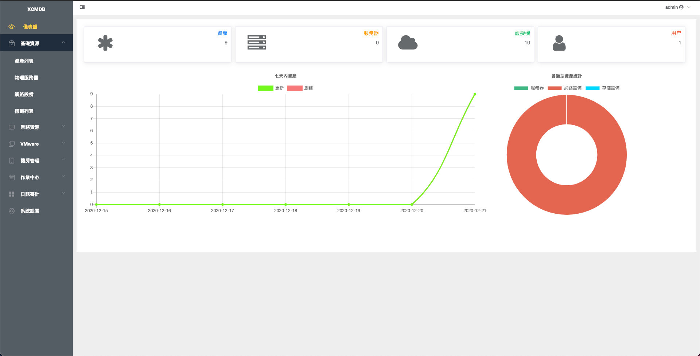
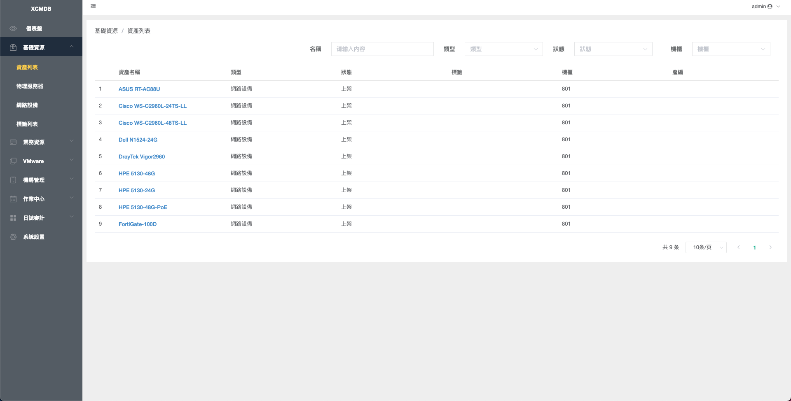
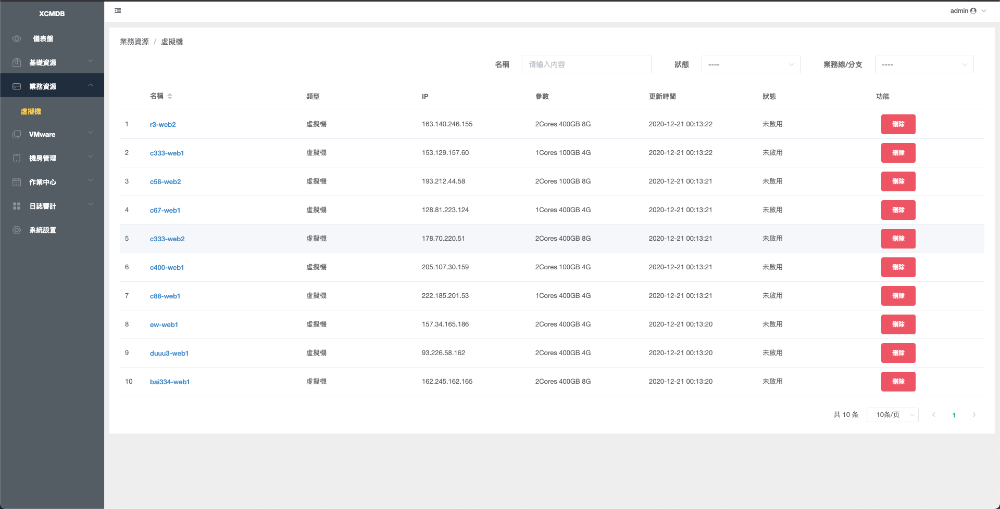
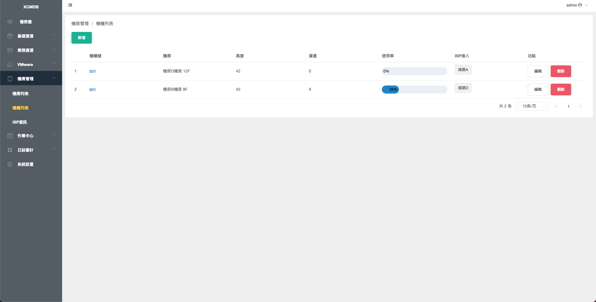
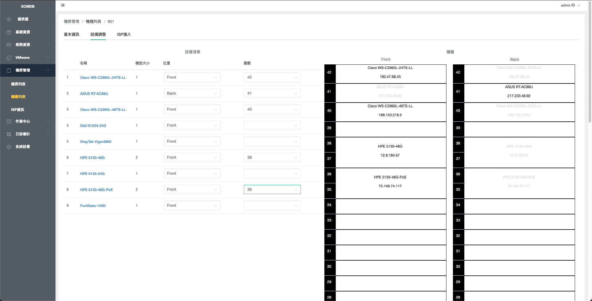
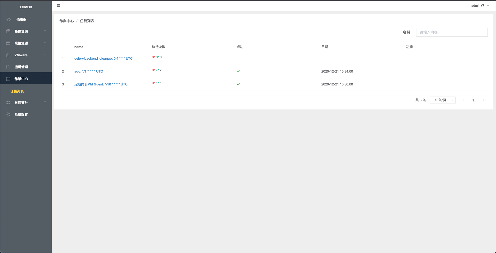
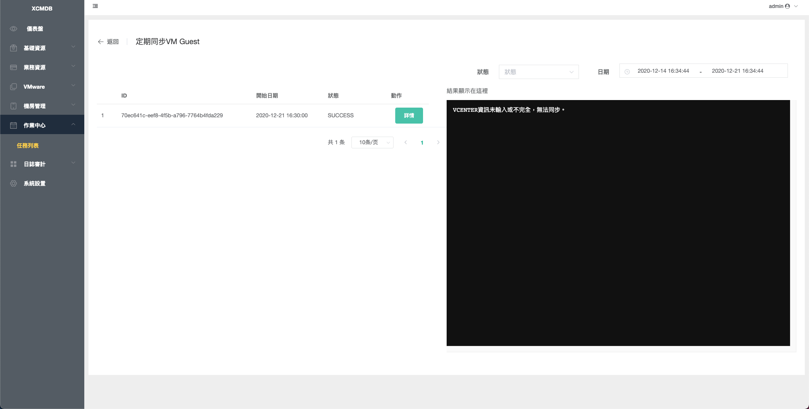
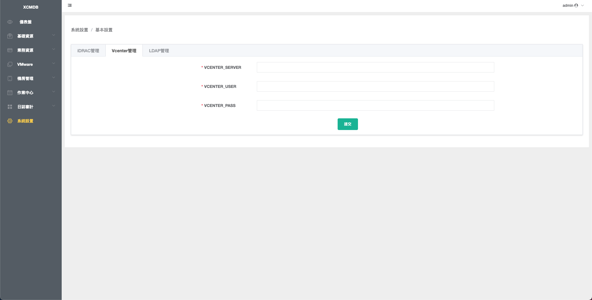

# XCMDB

簡易管理資產，定期採集ESXI、vsphere資源，IDC管理。

# 開發語言與框架

- 編程語言：Python3.6
- 前端Web框架：Vue.js
- 後端Web框架：Django
- 後端Task框架：Celery + Redis

# 功能

- 支持LDAP登入
- 資產管理
- 機房/機櫃 管理
- 採集iDRAC信息
- 採集vsphere信息(Cluster、Host、Instance)
- 快速創建Vmeare虛擬機

# 目錄

```
ansible # 用於推送腳本
client # 虛擬機資產回報agent
backend # 後台服務端
frontend # 前台服務端
```

# 核心依賴

- [pyvsphere](https://github.com/Maliaotw/pyvsphere.git)
- [pyesxi](https://github.com/Maliaotw/pyesxi.git)

# Deploy

```
docker-compose -f docker-compose-dev.yml up
docker-compose -f docker-compose-dev.yml exec openresty bash -c "nginx -s reload"
```

# 頁面展示

首頁


資產列表


虛擬機列表


機櫃列表


機櫃管理


任務列表


任務詳情


系統設置

